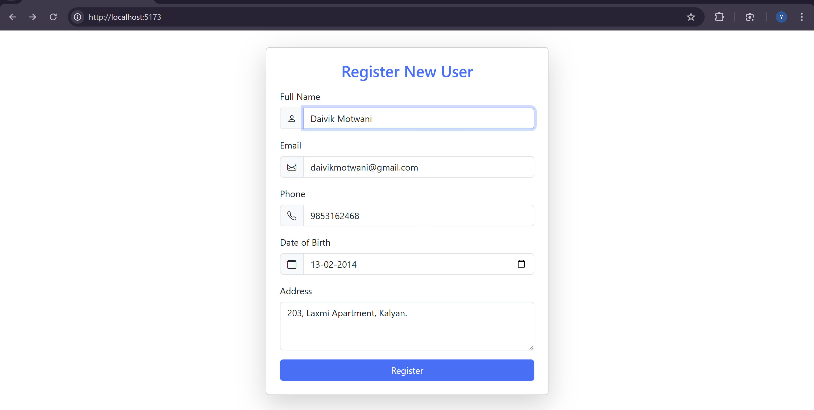
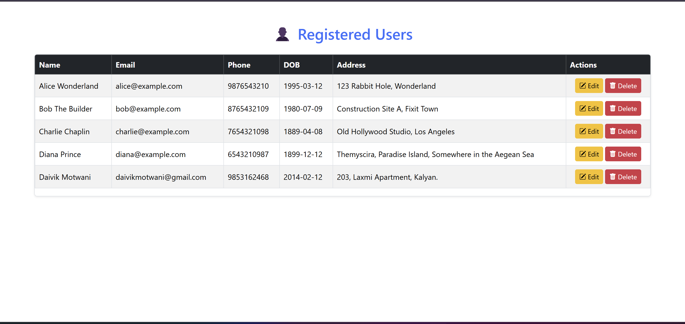
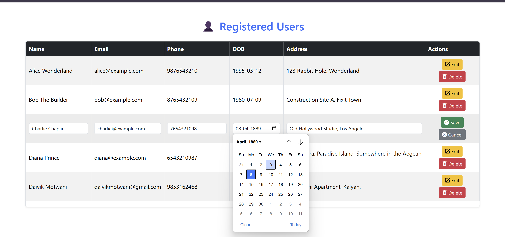
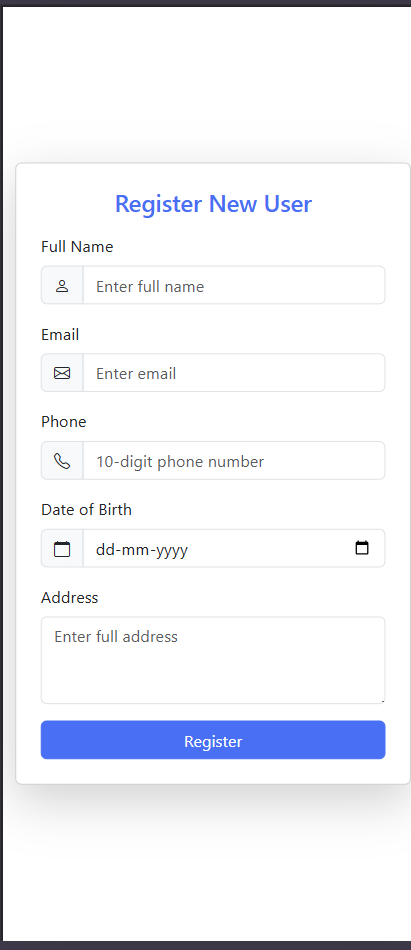
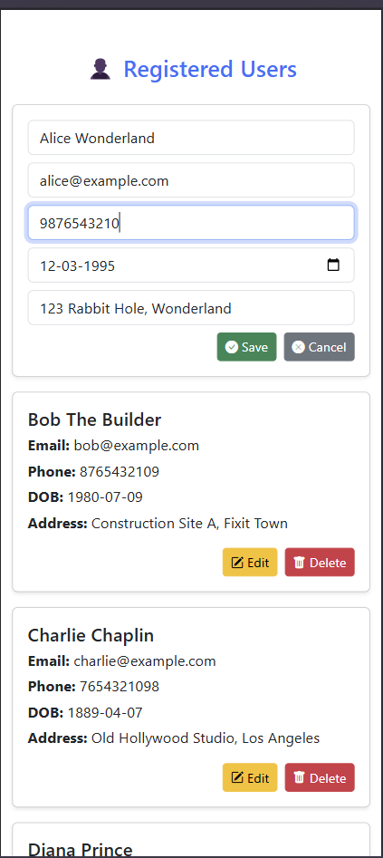

Here's a complete `README.md` file for **User Registration System** project using React, Express, and MySQL:

---

#  User Registration System

This is a **Full Stack Web Application** that allows users to register and view all registered users in a table with options to **update** and **delete** users. The system is built using:

- **Frontend:** React (Vite)
- **Backend:** Express.js
- **Database:** MySQL

Responsive UI is powered by **Bootstrap**, and all API calls are handled using **Axios**.

---

##  Project Structure

```
user-registration-system/
├── backend/             # Express.js server and API routes
│   ├── server.js
│   ├── routes/
│   └── controllers/
├── frontend/            # React (Vite) frontend
│   ├── src/
│   │   └── components/
│   │       └── UsersTable.jsx
│   └── index.html
└── README.md
```

---

## Features

- Register new users
- Display all users in a table and mobile-friendly card view
- Edit and update user details
- Delete users
- Date input and display handled in `YYYY-MM-DD` format
- Fully responsive design using Bootstrap

---

## Technologies Used

- React (Vite)
- Bootstrap 5
- Express.js
- MySQL
- Axios

---

## Setup Instructions

###Clone the Repository

```bash
git clone https://github.com/yourusername/user-registration-system.git
cd user-registration-system
```

---

###  Setup Backend

#### Install Dependencies

```bash
cd backend
npm install
```

####  Configure MySQL

- Create a MySQL database named `registration_app`.
- Use this SQL to create the `users` table:

```sql
CREATE TABLE users (
  id INT AUTO_INCREMENT PRIMARY KEY,
  name VARCHAR(100),
  email VARCHAR(100),
  phone VARCHAR(20),
  dob DATE,
  address VARCHAR(255)
);
```

####  Start the Backend Server

```bash
node server.js
```

The backend server will run on **http://localhost:5000**

---

###  Setup Frontend

#### Install Dependencies

```bash
cd ../frontend
npm install
```

####  Start the React App

```bash
npm run dev
```

The frontend will run on **http://localhost:5173**

---

##  API Endpoints

- `GET    /api/users` → Fetch all users
- `POST   /api/users` → Create new user
- `PUT    /api/users/:id` → Update a user
- `DELETE /api/users/:id` → Delete a user

---

## Screenshots

###  User Registration Form - Desktop View


### Registered Users - Desktop Table View


### CRUD operations - Desktop Table View


### User Registration Form - Mobile Card View


### CRUD operations - Mobile Card View



## Author

Developed by **Yeshita**

---

